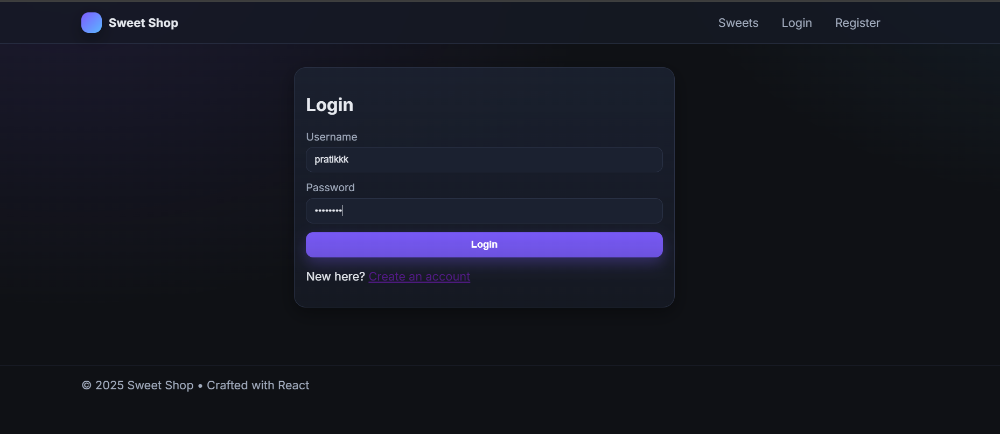
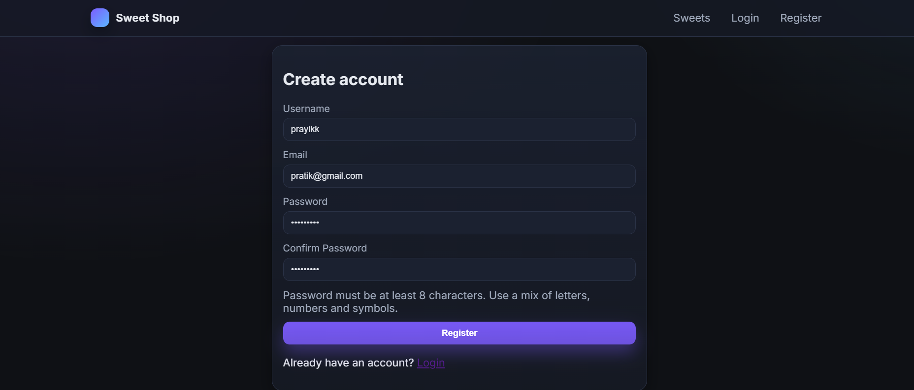
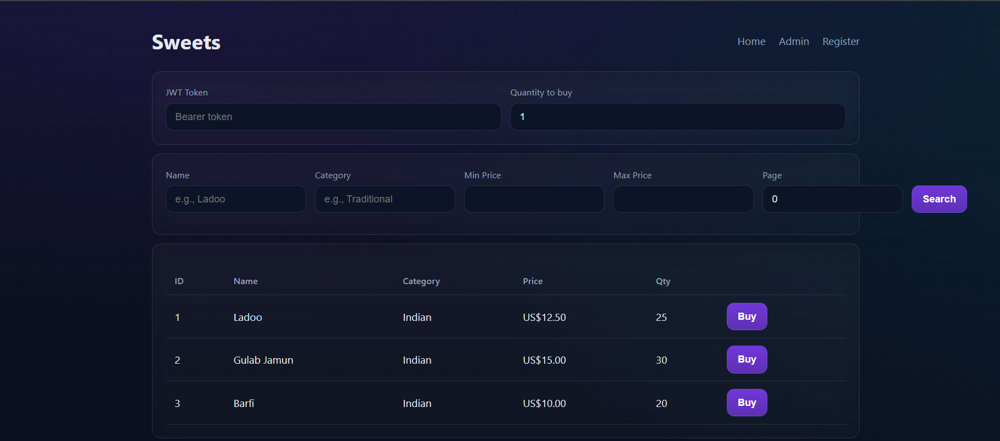
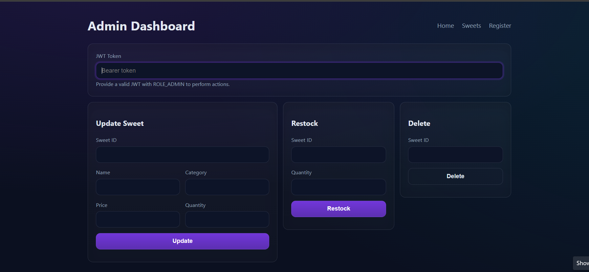

# Sweet Shop

A secure Spring Boot backend for managing sweets with JWT-based auth, migrations via Flyway, and a modern React (Vite + TypeScript) frontend. Includes comprehensive tests with coverage gates and an end-to-end PowerShell smoke script.

## Repository
Public repo: https://github.com/prattikkk/Incubyte

How to publish this project to GitHub (once per repo):

```powershell
git init
git add -A
git commit -m "feat: initial sweet-shop implementation"
git branch -M main
git remote add origin https://github.com/<your-username>/sweet-shop.git
git push -u origin main
```

## Features
- REST API for sweets CRUD, purchase, and search
- JWT auth (stateless) with roles: USER and ADMIN
- Method-level authorization for admin operations
- Flyway migrations and H2 (dev/test) + MySQL (prod)
- Global error handling with structured responses
- Tests (JUnit 5 + Spring Boot Test) and JaCoCo coverage gates
- UI options:
  - React app (Vite + TS) in `frontend/` with modern styling, toasts, and responsive layout
  - Lightweight static demo pages served by Spring Boot under `src/main/resources/static` (optional)
- E2E smoke script (`scripts/e2e-smoke.ps1`)

## Prerequisites
- Java 21
- PowerShell (Windows) for the e2e script
- Optional: MySQL for prod profile

## Quick start (Dev)
Runs against in-memory H2 with dev profile, seeds an admin user and roles via Flyway and a dev data loader.

```powershell
# Set a strong JWT secret (>= 32 bytes) and run the app
$env:APP_SECURITY_JWT_SECRET = '6e7b2a9f1d34c8a5f0d3b9e2c7a1f4e8b5c2d9a0e3f6c1b2a4d7e8f9c0b1a2ff'
$env:SPRING_PROFILES_ACTIVE = 'dev'
./mvnw -DskipTests spring-boot:run
```

Dev admin (seeded):
- username: `admin`
- password: `admin123`

Open static demo pages (optional):
- http://localhost:8080/
- http://localhost:8080/sweets.html
- http://localhost:8080/admin.html
- http://localhost:8080/register.html

Or run the React app during development (recommended):

```powershell
# In a new terminal
cd .\frontend
npm ci
npm run dev
# Open http://localhost:5173
```

The React dev server proxies API calls to the backend via Vite’s proxy (configured for `/api` → `http://localhost:8080`).

## API highlights
- POST `/api/auth/register` – create user (password must include upper, lower, digit)
- POST `/api/auth/login` – returns `{ token, expiresInMinutes }`
- GET `/api/sweets` – public list/search
- POST `/api/sweets` – create (requires auth)
- PUT `/api/sweets/{id}` – update (requires auth)
- POST `/api/sweets/{id}/purchase?quantity=Q` – purchase (requires auth)
- POST `/api/sweets/{id}/restock?quantity=Q` – admin only
- DELETE `/api/sweets/{id}` – admin only
- GET `/api/sweets/{id}` – requires auth

## Running tests and coverage

```powershell
# Full build with tests and coverage gates
./mvnw verify

# See specific suite output
Get-Content -Path target/surefire-reports/com.example.sweet_shop.controller.SweetControllerSecurityTest.txt

# Coverage HTML
# target/site/jacoco/index.html
```

## E2E smoke (optional)
Runs a full flow: register, login, public list, create, update, purchase, invalid purchase, restock permissions, delete, 404 after delete.

```powershell
# Ensure the backend is running on http://localhost:8080
powershell -NoProfile -ExecutionPolicy Bypass -File .\scripts\e2e-smoke.ps1
```

## Production setup (MySQL)
Set `SPRING_PROFILES_ACTIVE=prod` and configure environment variables:

```text
SPRING_DATASOURCE_URL=jdbc:mysql://<host>:3306/sweetshop?createDatabaseIfNotExist=true&useSSL=false&allowPublicKeyRetrieval=true&serverTimezone=UTC
SPRING_DATASOURCE_USERNAME=<user>
SPRING_DATASOURCE_PASSWORD=<password>
JWT_SECRET=<strong-32+byte-secret>
JWT_EXP_MINUTES=60
```

Start:
```powershell
$env:SPRING_PROFILES_ACTIVE='prod'
$env:SPRING_DATASOURCE_URL='jdbc:mysql://localhost:3306/sweetshop?createDatabaseIfNotExist=true&useSSL=false&allowPublicKeyRetrieval=true&serverTimezone=UTC'
$env:SPRING_DATASOURCE_USERNAME='root'
$env:SPRING_DATASOURCE_PASSWORD='<password>'
$env:JWT_SECRET='your-strong-secret'
./mvnw -DskipTests spring-boot:run
```

## Screenshots
Add your screenshots into the `docs/` folder so they render on GitHub. I’ve added convenient placeholders below; place the images with these names (or adjust the paths in README as you like).

### Gallery

- Login



- Register



- Login



- Register



- Extra (any additional UI/state)


### Quick import from your machine (Windows PowerShell)
Copy your existing screenshots into `docs/` with the expected names:

```powershell
New-Item -ItemType Directory -Force .\docs | Out-Null
Copy-Item "c:\Users\prati\OneDrive\Pictures\Screenshots\Screenshot 2025-09-19 220303.png" .\docs\screenshot-1.png
Copy-Item "c:\Users\prati\OneDrive\Pictures\Screenshots\Screenshot 2025-09-19 220222.png" .\docs\screenshot-2.png
Copy-Item "c:\Users\prati\OneDrive\Pictures\Screenshots\Screenshot 2025-09-19 220209.png" .\docs\screenshot-3.png
Copy-Item "c:\Users\prati\OneDrive\Pictures\Screenshots\Screenshot 2025-09-19 220118.png" .\docs\screenshot-4.png
Copy-Item "c:\Users\prati\OneDrive\Pictures\Screenshots\Screenshot 2025-09-19 213004.png" .\docs\screenshot-5.png
Copy-Item "c:\Users\prati\OneDrive\Pictures\Screenshots\Screenshot 2025-09-19 212951.png" .\docs\screenshot-6.png
Copy-Item "c:\Users\prati\OneDrive\Pictures\Screenshots\Screenshot 2025-09-19 212925.png" .\docs\screenshot-7.png
```

Commit and push:

```powershell
git add docs/*.png README.md
git commit -m "docs: add UI screenshots to README"
git push
```

## My AI Usage
- I used an AI pair programmer to:
  - Scaffold and refactor Spring Boot components (controllers/services/security)
  - Set up Flyway migrations and dev/test/prod profiles
  - Implement global exception handling and tests
  - Write the end-to-end PowerShell smoke script
  - Triage and fix issues (JWT secret strength, exception mappings, test expectations)
- All generated code was reviewed, adjusted to match requirements, and validated by running unit/integration tests, coverage checks, and smoke tests.

## Troubleshooting

### React app build and preview
Build the React app and run a local static preview server:

```powershell
cd .\frontend
npm run build
npm run preview
# Open the printed URL (default http://localhost:4173)
```

If you want Spring Boot to serve the built React app, copy the contents of `frontend/dist/` into `src/main/resources/static/` (or configure your preferred asset pipeline). In dev, using Vite (`npm run dev`) is preferred.
- WeakKeyException: provide a secret >= 32 bytes via `APP_SECURITY_JWT_SECRET` (dev) or `JWT_SECRET` (prod).
- 401 on protected endpoints: include `Authorization: Bearer <token>` from `/api/auth/login`.
- Duplicate user registration: returns 400 with `illegal_argument`; use a new username/email or adjust data.
- H2 dev data is ephemeral; restart clears state.

## License
MIT (adjust as needed).
# Sweet Shop Backend

## Overview
Sweet Shop is a Spring Boot 3 / Java 21 backend providing JWT-secured APIs for managing sweets and user authentication/authorization with role-based access (USER, ADMIN). It demonstrates clean layering (controller → service → repository), database migrations with Flyway, specification-based search, and comprehensive automated tests with enforced code coverage (JaCoCo).

## Tech Stack
- Java 21, Spring Boot 3.5.x
- Spring Web, Spring Data JPA, Spring Security (stateless JWT)
- Flyway for DB migrations
- MySQL (production), H2 in-memory (tests)
- JJWT (io.jsonwebtoken) for token generation/validation
- JUnit 5 + Spring Boot Test + MockMvc + Mockito
- JaCoCo coverage enforcement (Line ≥ 70%, Branch ≥ 50%)
- Lombok for boilerplate reduction

## Architecture & Design
- Entities: User, Role, Sweet (with auditing timestamps)
- DTOs separate API contracts from persistence
- Service layer encapsulates business logic (validation, stock adjustments, search spec composition)
- Repository layer: Spring Data JPA + Specification API for dynamic filtering
- Security: Stateless JWT, custom `JwtAuthenticationFilter`, custom `RestAuthenticationEntryPoint` (JSON 401 responses), method-level security with `@PreAuthorize` for admin-only operations
- Error Handling: Central `GlobalExceptionHandler` producing structured JSON payloads (consistent error codes and messages)
- Database migrations (`db/migration/V1__init.sql`) create schema + seed roles

## Key Features
- User registration & login (JWT issued with roles claim)
- Role-based authorization (ADMIN required for sweet creation, update, delete, restock)
- Sweet CRUD & stock operations (purchase decrements quantity with validation; restock increments)
- Dynamic search (name contains, category equals, price min/max)
- Consistent error responses (validation, illegal argument, unauthorized, forbidden)
- Enforced test coverage thresholds

## API Summary (High-Level)
Auth:
- POST /api/auth/register – Register new user
- POST /api/auth/login – Login, returns JWT token and metadata

Sweets:
- GET /api/sweets – Public list/search (query params: name, category, minPrice, maxPrice)
- GET /api/sweets/{id} – Public sweet details
- POST /api/sweets – ADMIN create
- PUT /api/sweets/{id} – ADMIN update
- DELETE /api/sweets/{id} – ADMIN delete
- POST /api/sweets/{id}/purchase?quantity=N – USER/ADMIN purchase (auth required)
- POST /api/sweets/{id}/restock?quantity=N – ADMIN restock

Auth Header: `Authorization: Bearer <token>`

## Error Response Format
```
{
  "error": "validation_failed | unauthorized | forbidden | illegal_argument | internal_error",
  "message": "Human readable details",
  "timestamp": "2025-01-01T12:34:56Z"
}
```
Validation errors include a `fieldErrors` object.

## Build & Run (Dev)
1. Ensure JDK 21 and Maven installed.
2. Configure a MySQL database (or adjust to use H2 if desired).
3. Set environment variables or override in `application.properties`:
   - `SPRING_DATASOURCE_URL=jdbc:mysql://localhost:3306/sweetshop` (example)
   - `SPRING_DATASOURCE_USERNAME=...`
   - `SPRING_DATASOURCE_PASSWORD=...`
   - `JWT_SECRET=replace-with-strong-secret` (at least 256-bit for HS256)
4. Run: `mvn spring-boot:run`

## Test Profile
- Activated via `@ActiveProfiles("test")` in tests.
- Uses H2 in-memory DB + Flyway migrations (clean, isolated schema each run).

## Running Tests & Coverage
Execute: `mvn clean verify`
This runs all tests and enforces coverage rules. Failing thresholds break the build.

### Current Coverage Snapshot (from last successful build)
- Instructions: 1082 covered / 1263 total (approx 85.7%)
- Lines: 222 covered / 245 total (approx 90.6%)
- Branches: 40 covered / 60 total (approx 66.7%)
(Computed from JaCoCo XML summary.)

Thresholds configured: Line ≥ 70%, Branch ≥ 50% (both satisfied).

Report location after build: `target/site/jacoco/index.html`

## Security Model
- JWT signed with HS256; roles encoded in token claims.
- Filter extracts token, validates, loads user, sets `SecurityContext`.
- Anonymous disabled to distinguish between 401 (unauthenticated) and 403 (authenticated but forbidden).
- Method-level restrictions: purchase allowed for any authenticated user; create/update/delete/restock restricted to ADMIN.

## Database Migration Strategy
- Versioned Flyway scripts in `src/main/resources/db/migration`.
- Schema evolves via additive migrations; avoid in-place modifications after release.

## Environment Variables (Recommended)
| Variable | Purpose |
|----------|---------|
| SPRING_DATASOURCE_URL | JDBC URL for MySQL prod/stage |
| SPRING_DATASOURCE_USERNAME | DB user |
| SPRING_DATASOURCE_PASSWORD | DB password |
| JWT_SECRET | Symmetric signing key (base64 or plain strong secret) |
| SERVER_PORT | Override default port (optional) |

Quick start (Windows PowerShell):

```
$env:SPRING_DATASOURCE_URL = "jdbc:mysql://localhost:3306/sweetshop?createDatabaseIfNotExist=true&useSSL=false&allowPublicKeyRetrieval=true&serverTimezone=UTC"
$env:SPRING_DATASOURCE_USERNAME = "sweet_user"
$env:SPRING_DATASOURCE_PASSWORD = "<secure-password>"
$env:JWT_SECRET = "<at-least-256-bit-random-secret>"
```

Recommended: use a non-root MySQL user with least privilege:

```
mysql -u root -p -e "
CREATE DATABASE IF NOT EXISTS sweetshop;
CREATE USER IF NOT EXISTS 'sweet_user'@'%' IDENTIFIED BY '<secure-password>';
GRANT ALL PRIVILEGES ON sweetshop.* TO 'sweet_user'@'%';
FLUSH PRIVILEGES;"
```

Note: `application.properties` does not contain any plaintext DB password. Supply secrets via environment variables or a secrets manager.

## Production Configuration
Prod profile is provided at `src/main/resources/application-prod.properties` and references environment variables. Run with `--spring.profiles.active=prod`.

## Local Quick Smoke (H2 override)
You can temporarily switch datasource to H2 (dev) for quick demos; ensure Flyway still enabled.

## Frontend
A React + Vite (TypeScript) SPA lives in `frontend/` and includes:
- Authentication context & login page (`/login`)
- Public sweets listing & search (GET /api/sweets)
- Purchase action (authenticated)
- Admin dashboard for create / update / restock / delete sweets (ROLE_ADMIN)

### Dev Setup
In a separate terminal:

```
cd frontend
npm install
npm run dev
```

The dev server (default http://localhost:5173) proxies `/api` to `http://localhost:8080` (configured in `vite.config.ts`). Ensure the backend is running first.

### Build Frontend
```
cd frontend
npm run build
```
Outputs production assets to `frontend/dist/` (can later be served by a CDN, Nginx, or integrated into the backend static resources if desired).

### Auth Handling
JWT token stored in memory + `localStorage` (simple persistence). For heightened security (XSS defense) consider:
- Avoid long-lived tokens
- Use refresh token flow (server-managed) or rotate tokens
- Store in httpOnly cookie (requires backend changes)

### Future Frontend Enhancements
- Form validation & better UX states
- Pagination & sorting controls
- Global error boundary & toast notifications
- Dark mode / theming

## CI/CD
GitHub Actions pipeline:
- Checkout, set up JDK 21
- Cache Maven dependencies
- `mvn -B clean verify`
- Upload JaCoCo report artifact
- (Later) Build frontend and publish combined artifact / container image

Current CI sample workflow (add under `.github/workflows/ci.yml`):
```
name: CI
on:
  push:
    branches: [ main ]
  pull_request:
    branches: [ main ]
jobs:
  backend:
    runs-on: ubuntu-latest
    steps:
      - uses: actions/checkout@v4
      - name: Set up JDK 21
        uses: actions/setup-java@v4
        with:
          distribution: temurin
          java-version: '21'
          cache: maven
      - name: Build & Test
        run: mvn -B -q verify
      - name: Upload Coverage Report
        uses: actions/upload-artifact@v4
        with:
          name: jacoco-report
          path: target/site/jacoco
  frontend:
    runs-on: ubuntu-latest
    needs: backend
    steps:
      - uses: actions/checkout@v4
      - name: Setup Node
        uses: actions/setup-node@v4
        with:
          node-version: '20'
          cache: 'npm'
          cache-dependency-path: frontend/package-lock.json
      - name: Install & Build
        working-directory: frontend
        run: |
          npm ci || npm install
          npm run build
      - name: Upload Frontend Dist
        uses: actions/upload-artifact@v4
        with:
          name: frontend-dist
          path: frontend/dist
```

## My AI Usage
- Tools used: GitHub Copilot (in-editor), ChatGPT (design/diagnostics), and inline model assistance.
- How I used them:
  - Brainstormed API surface and security configuration (filters, entry points).
  - Generated initial DTOs, controllers, and tests following TDD, then refactored.
  - Drafted CI workflow and frontend scaffolding, then customized.
  - Troubleshot env/profile issues (H2 vs MySQL), Flyway compatibility, and property binding.
- Reflection: AI accelerated boilerplate and offered quick patterns, but I validated business rules, security, and error handling. Tests and coverage gates ensured quality. All credentials and secrets were moved to environment variables per best practice.

## Screenshots
Add screenshots of:
- Login and Register pages
- Sweets list with purchase button disabled at quantity 0
- Admin dashboard (create, update, restock, delete)

## Contributing Guidelines (Brief)
1. Create feature branch
2. Add/adjust tests (maintain coverage thresholds)
3. Run `mvn clean verify` before PR
4. Keep migrations idempotent and additive

## License
MIT (or specify your chosen license).

---
Generated & maintained with a test-first mindset and automated quality gates.
