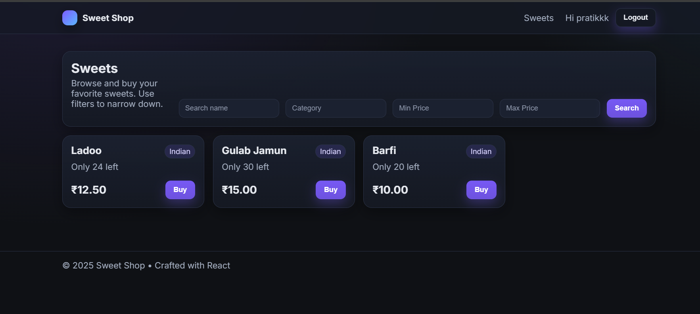

# Sweet Shop

A secure Spring Boot backend with a modern React (Vite + TypeScript) frontend for managing sweets. It features JWT-based security, Flyway migrations, strong tests with coverage gates, and a small E2E smoke script. This README was refactored for clarity and now references the latest screenshots you provided.

Repository: https://github.com/prattikkk/Incubyte

## Contents
- Overview
- Features & Tech Stack
- Architecture
- Getting Started (Backend & Frontend)
- Configuration (Env Vars)
- API at a Glance
- Tests & Coverage
- E2E Smoke
- Production (MySQL)
- Screenshots
- Troubleshooting
- CI/CD
- Contributing & License

## Overview
Sweet Shop exposes REST APIs for managing sweets and user accounts, secured with stateless JWT. The React app consumes the same APIs and provides a polished UX (toasts, responsive layout, admin tools). Dev profile uses H2; prod uses MySQL.

## Features & Tech Stack
- Spring Boot 3.5, Java 21, Spring Web, Data JPA, Security
- JWT auth with roles (USER, ADMIN); method-level access control
- Flyway migrations; H2 (dev/test) and MySQL (prod)
- Global exception handling with consistent JSON
- Tests with JaCoCo coverage thresholds
- Frontend: React 18 + Vite + TypeScript, axios, react-router; reusable UI kit and toasts

## Architecture
- Layered backend (controller → service → repository) with DTOs
- `JwtAuthenticationFilter` and custom `RestAuthenticationEntryPoint`
- Search via JPA Specification (name/category/price filters)
- Flyway `V1__init.sql` creates schema and seeds roles

## Getting Started

### Prerequisites
- JDK 21 and Maven
- Node.js 20+ (for the React app)
- Windows PowerShell (for provided scripts)

### Backend (dev)
Runs with H2 and a seeded admin.

```powershell
$env:APP_SECURITY_JWT_SECRET = '6e7b2a9f1d34c8a5f0d3b9e2c7a1f4e8b5c2d9a0e3f6c1b2a4d7e8f9c0b1a2ff'
$env:SPRING_PROFILES_ACTIVE = 'dev'
./mvnw -DskipTests spring-boot:run
```

Seeded admin:
- username: admin
- password: admin123

Optional static demo pages: http://localhost:8080/ (index, sweets.html, admin.html, register.html)

### Frontend (dev)

```powershell
cd .\frontend
npm ci
npm run dev
# Open http://localhost:5173
```

The dev server proxies `/api` to `http://localhost:8080` (configured in `vite.config.ts`). Ensure the backend is running first.

## Configuration
Common environment variables:

```text
# Dev
APP_SECURITY_JWT_SECRET=<32+ byte secret>
SPRING_PROFILES_ACTIVE=dev

# Prod
SPRING_PROFILES_ACTIVE=prod
SPRING_DATASOURCE_URL=jdbc:mysql://<host>:3306/sweetshop?createDatabaseIfNotExist=true&useSSL=false&allowPublicKeyRetrieval=true&serverTimezone=UTC
SPRING_DATASOURCE_USERNAME=<user>
SPRING_DATASOURCE_PASSWORD=<password>
JWT_SECRET=<32+ byte secret>
JWT_EXP_MINUTES=60
```

## API at a Glance
- POST /api/auth/register – Register user (password must include upper/lower/digit)
- POST /api/auth/login – Returns `{ token, expiresInMinutes }`
- GET /api/sweets – Public list/search
- GET /api/sweets/{id} – Details (auth may be required depending on config)
- POST /api/sweets – Create (auth)
- PUT /api/sweets/{id} – Update (auth)
- POST /api/sweets/{id}/purchase?quantity=N – Purchase (auth)
- POST /api/sweets/{id}/restock?quantity=N – Admin only
- DELETE /api/sweets/{id} – Admin only

Authorization header: `Authorization: Bearer <token>`

## Tests & Coverage

```powershell
./mvnw verify
# Coverage HTML: target/site/jacoco/index.html
```

## E2E Smoke

```powershell
powershell -NoProfile -ExecutionPolicy Bypass -File .\scripts\e2e-smoke.ps1
```

## Production (MySQL)

```powershell
$env:SPRING_PROFILES_ACTIVE='prod'
$env:SPRING_DATASOURCE_URL='jdbc:mysql://localhost:3306/sweetshop?createDatabaseIfNotExist=true&useSSL=false&allowPublicKeyRetrieval=true&serverTimezone=UTC'
$env:SPRING_DATASOURCE_USERNAME='root'
$env:SPRING_DATASOURCE_PASSWORD='<password>'
$env:JWT_SECRET='your-strong-secret'
./mvnw -DskipTests spring-boot:run
```

## Screenshots
The previous screenshots were replaced. The gallery below uses the four new images placed in `docs/screenshots/`.

### Gallery

- Admin Dashboard


- Sweets Catalog



- Login


- Register


## Troubleshooting
- WeakKeyException: ensure a secret >= 32 bytes (`APP_SECURITY_JWT_SECRET` or `JWT_SECRET`).
- 401 on protected endpoints: include `Authorization: Bearer <token>` from `/api/auth/login`.
- Duplicate registration (400 illegal_argument): use a new username/email.
- H2 dev data is ephemeral; restart clears state.

## CI/CD
Sample workflow builds backend and frontend and uploads artifacts. See `.github/workflows/ci.yml` in the repo for a template.

## Contributing & License
- PRs welcome. Keep tests green and coverage thresholds satisfied.
- License: MIT.
